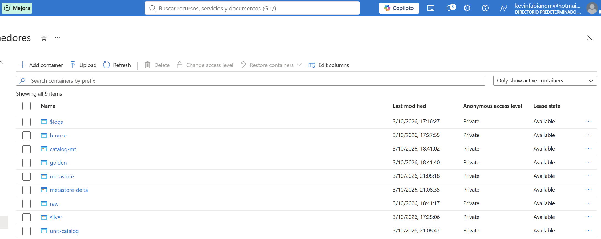
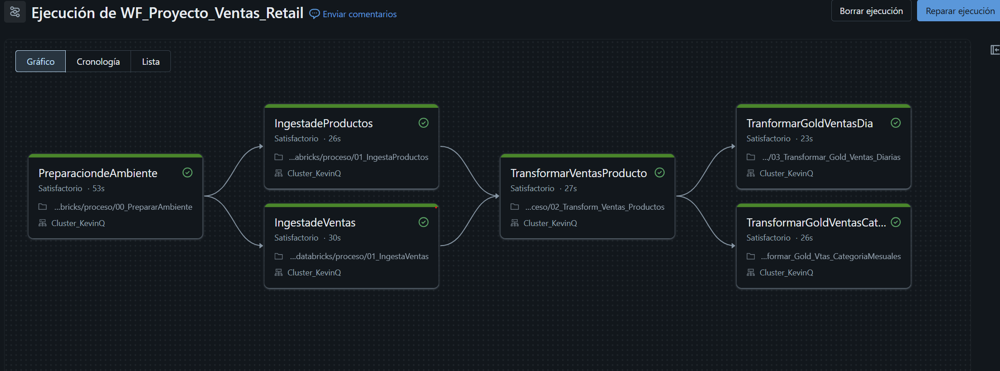

# Proyecto-databricks

> Este proyecto consiste en un pipeline completo de ingeniería de datos construido sobre Azure Databricks, que procesa información de ventas y productos de una cadena retail siguiendo una arquitectura medallion.

# Características principales:

- Arquitectura Medallón completa (Bronce → Plata → Dorado) sobre Catálogo Unitario
- Ingesta parametrizada con dbutils.widgets(catálogo, esquemas, nombre del almacenamiento) — sin valores fijos en el código
Gobernanza de datos mediante Ubicaciones Externas y Credenciales de Almacenamiento de Unity Catalog
- Reglas de negocio aplicadas con Spark en lugar de UDF, por rendimiento
Agregaciones Golden listas para análisis: ventas diarias por tienda y ventas mensuales por categoría
- Pipeline orquestado como job de Databricks Workflows ( WF_Proyecto_Ventas_Prod) con dependencias entre tareas
- CI/CD con GitHub Acciones que exporta, despliega y ejecuta automáticamente el pipeline en producción
- Notebook de reversión ( reversion/reverso.ipynb) para limpiar tablas y datos del esquema completo

# Conjunto de datos utilizado:
> 
> Los datos provienen de dos archivos planos cargados al contenedor raw:

- items.csv: Catálogo de productos — ID, nombre y categoría	39.194
- orders.csv: Pedidos de venta — tienda, fecha, artículo, cantidad, precio, descuento, vendedor y estado	1.090.380

> Autor: Kevin Quispe

